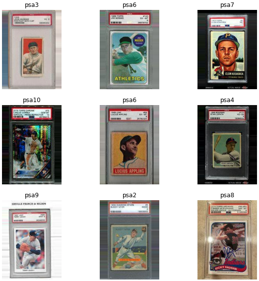

# PSA-Grades-Baseball



PSA-Grades-Baseball is a dataset of baseball card images and associated [Professional Sports Authenticator (PSA)](https://www.psacard.com) grades. PSA-Grades-Baseball contains 1150 baseball card images for each of the 10 major PSA grades totaling 11500 images.

### Data Collected With

* [ParseHub](https://www.parsehub.com)
* [Collectors.com](https://www.collectors.com)

## Getting Started

These instructions will get you a copy
of the dataset on your local machine.

### Installation

The following are different options to download the dataset:

#### GitHub

1. Clone the repository.

```bash
git clone https://github.com/samsilverman/PSA-Grades-Baseball.git
```

2. **Optional**: If using automatic dataset generators such as `tf.keras.preprocessing.image_dataset_from_directory`, you may want to copy the psa directories from the repository to a separate directory to avoid miscellaneous files (i.e. git files) from being mistaken for classes.

#### Zip

1. Download the latest version of the dataset from [Releases](https://github.com/samsilverman/PSA-Baseball-Grades/releases).

## Details

The following steps were applied to each scrapped image to ensure a consistent format for all images in the dataset:

1. Ensure a consistent image size of `150x200`. This was done in a three-step process (code in `dataset_processor.py`):

    1. Images with `width > height` were rotated clockwise by 90°.

    2. Images were scaled to `150x200` (or as possible).

    3. Images that could not be exactly scaled to `150x200` were padded using replication of pixel values.

2. A simple file structure was implemented for ease of use:

```file
📦 PSA-Grades-Baseball/
    📁 psa1/
        🖼 psa1_1.jpg
        🖼 psa1_2.jpg
        ...
        🖼 psa1_1150.jpg
    📁 psa2/
    ...
    📁 psa10/
```

## Known Issues

The following are a list of known issues with the dataset that should be addressed:

1. The dataset may contain "bad" data which consists of one or more of the following:

    1. Duplicate images

    2. Incorrect image grades

    3. irrelevant images

2. The dataset contains unimportant features which consist of one or more of the following:

    1. Hands and tables

    2. Colorful and detailed backgrounds

    3. PSA grade cases and labels

## AutoGrade: A Deep Learning Approach to Trading Card Grading

AutoGrade is a deep learning system that was trained on PSA-Grades-Baseball to provide estimates on PSA grades. AutoGrade and PSA-Grades-Baseball were developed as a final project for the course COMS 4995 (see Acknowledgements for more).

[View AutoGrade Video 🎥](https://youtu.be/RiO3hh_IE7M)

## Contact

Sam Silverman - [@sam_silverman](https://twitter.com/sam_silverman) - [samuel.silverman@columbia.edu](mailto:samuel.silverman@columbia.edu)

Project Link: [https://github.com/samsilverman/PSA-Grades-Baseball](https://github.com/samsilverman/PSA-Grades-Baseball)

## Acknowledgements

* [OpenCV](https://opencv.org)
* [TensorFlow](https://www.tensorflow.org)
* [Best README Template](https://github.com/othneildrew/Best-README-Template)

PSA-Grades-Baseball was created for a final project for the course [COMS 4995: Deep Learning for Computer Vision](https://www.deeplearningforcomputervision.com) taught by Prof. Peter Belhumeur.
